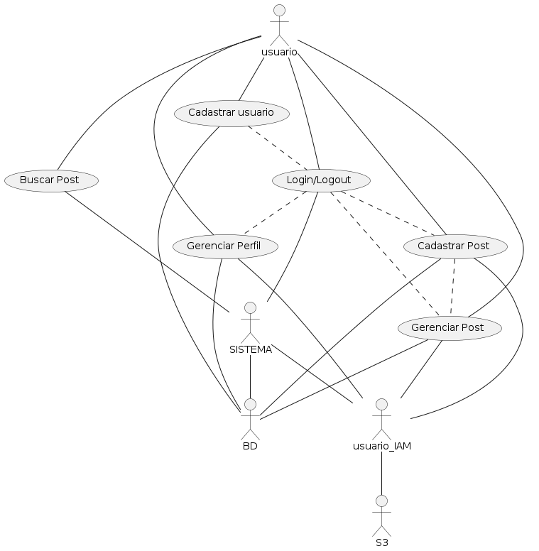

# Spoof

Spoof é uma aplicação de gerenciamento de objetos multimídia desenvolvido para armazenar imagens, vídeos e áudios dos usuários. Estes podem ter um processamento adicional com base na escolha de usuário.

Essa aplicação foi desenvolvida como Prova de Conceito para utilizar os serviços de nuvem providos pela Amazon, a AWS, durantte as aulas de Tópicos em Engenharia de Software na Universidade Federal do Piauí.

## Funcionalidades implementadas

A aplicação base utiliza serviços da AWS para o armazenamento dos objetos multimidias (imagens, vídeos e áudios). Logo, é importante destacar que deve ser incluída as credenciais (backend) no arquivo de configuração (.env) seguindo o modelo do arquivo ".env-example" para fazer a aplicação rodar corretamente. Com isto configurado e com a aplicação executando corretamente, os usuários poderão realizar qualquer ação desenvolvida e disponível. São elas:

    

1. **Cadastro de usuário**: Para acessar a plataforma, o usuário deve ter um cadastro devidamente confirmado.

    > Não precisa fazer confirmação real de email e telefone, mas deve informar a sintaxe correta nos campos.

2. **Login e Logout**: Fazer uso das credenciais criadas no momento do cadastro da conta para fazer o Login - entrar na aplicação, e logout - sair da aplicação.
3. **Gerenciar Post**: Fazer o gerenciamento das informações de usuário, exceto o nome completo informado no momento do cadastro. Isso possibilita que o usuário veja suas informações e edite-as.
4. **Cadastrar Post**: Permite que o usuário possa fazer o cadastro de posts adicionando algumas informações a ele, além de apenas um objeto multimídia.
5. **Gerenciamento de Post**: Permite que o usuário possa excluir ou editar informações textuais dos posts já criados, além de os visualizar.

    > Só é permitido fazer estas operações com os próprios Posts.

6. **Pesquisar por post(s)**: Permite que o usuário possa pesquisar por posts usando elementos textuais ou filtros de pesquisa.

    > Só é permitido fazer estas operações com os próprios Posts.

<!-- Falar sobre a arquitetura da aws usada -->

## Projeto

A aplicação foi desenvolvida completamente pelos desenvolvedores, back-end e front-end, e os códigos e configurações podem ser visto neste mesmo repositório. Para ver como configurar e rodar cada componente de aplicação, siga a documentação fornecida no próprio diretório.

- **backend**: [Aplicação com Nestjs e Prisma para a contrução do backend](./backend/)
- **frontend**: [Aplicação next com componentes do MaterialUI para a construção do frontend](./frontend/spoof/)

## Desenvolvimento

- **Git flow**: git ja esta no .git, mas é necessário colocar git flow init e seguir dando enter igual visto no video para a estrutura do gitflow ser reconhecida pela máquina local em que você esta desenvolvendo.
- **Versionamento**: A versão da aplicação segue os padrões básicos informados no documento "Semantic Version 2.0.0", semver.org, (n.a.). Disponível em https://semver.org/.