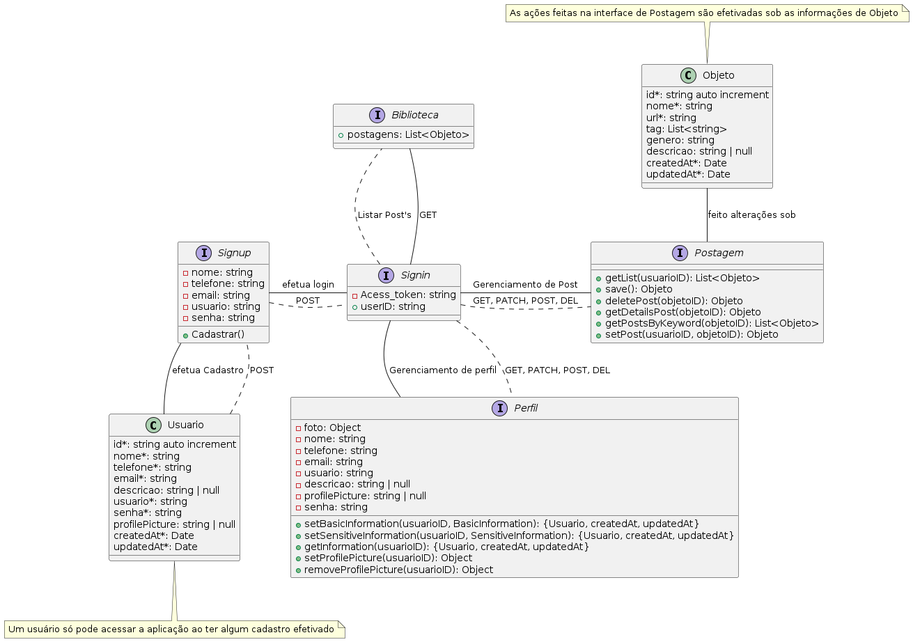

# Backend

Componente da aplicação Spoof responsável por receber requisiçõess do cliente, processá-las e retornar uma resposta satisfatória que deverá ser tratada seguindo a documentação.

O backend foi desenvolvido por meio de um projeto **React com nestJS + Prisma** e usando o **gerenciador de pacotes pnpm**, uma versão melhorada do npm do NodeJS.

## Estrutura

Uma representação da implementação da API pode ser vista na imagem logo a seguir, que descreve como ocorre a comunicação entre os componentes implementados e os verbos HTTPs usados (resumo).

<div style="display: flex; justify-content: center;">
    
</div>

Como pode ser visto, o usuário precisa criar uma conta para poder ter acesso a funcionalidade de Login, necessária para conseguir o **access_token** para acessar a aplicação. É importante destacar que o token expira apó´s 30 minutos.

Dentre as funcionalidades implementadas estão:
1. Cadastrar Usuário;
2. Logar;
3. Postar Objeto Multimidia;
4. Obter Lista de Objetos Multimidia Postados;
5. Obter Detalhes de um Objeto Multimidia Postado;
6. Excluir Objeto Multimidia Postado;
7. Editar Objeto Multimidia Postado;
8. Baixar o Objeto Multimidia no lado do cliente: exibir o objeto multimidia;
9. Obter Informações do Perfil do Usuário;
10. Alterar a Foto de Perfil do Usuário;
11. Alterar Informações básicas do Usuário;
12. Alterar Informações Sensíveis do Usuário;
13. Deletar Foto de Perfil, colocando uma foto default;

## Projeto NestJS

O NestJS é um framework progressivo para Node.js que ajuda a construir aplicações server-side eficientes e escaláveis. Ele utiliza TypeScript por padrão e é inspirado em conceitos de programação orientada a objetos, funcional e reativa.

### Vantagens do NestJS

- **Modularidade**: Facilita a organização do código em módulos, tornando a aplicação mais fácil de manter e escalar.
- **Injeção de Dependência**: Oferece um sistema robusto de injeção de dependência, facilitando a gestão de dependências e a escrita de testes.
- **Suporte a Diversos Protocolos**: Suporta HTTP, WebSockets, GraphQL, e muito mais.

## Integração com Prisma

O Prisma é um ORM (Object-Relational Mapping) moderno e eficiente para Node.js e TypeScript. Ele facilita o trabalho com bancos de dados, oferecendo uma camada de acesso a dados segura e tipada.

### Vantagens do Prisma

- **Type-Safety**: Garante segurança de tipos, reduzindo erros em tempo de execução.
- **Migrations**: Facilita a criação e aplicação de migrações de banco de dados.
- **Query Builder**: Oferece uma API intuitiva para construir consultas SQL.

## Recursos usados

- **Node.js 20.x**: Utilizado como ambiente de execução JavaScript, com gerenciamento de pacotes através do **PNPM**.
- **NestJS 10.x**: Framework robusto para construção de aplicações Node.js escaláveis e eficientes, utilizado em conjunto com Prisma para mapeamento objeto-relacional (ORM), facilitando a interação com o banco de dados.
- **Axios**: Biblioteca poderosa para fazer requisições HTTP, essencial para a coleta e manipulação de dados de APIs externas.
- **Passport**: Middleware de autenticação flexível para Node.js, utilizado para gerenciar a autenticação dos usuários de forma segura e eficiente.
- **bcrypt**: Biblioteca confiável para criptografia, utilizada para garantir a segurança das senhas dos usuários através de hashing.
- **JWT (JSON Web Token)**: Utilizado para geração de tokens de autenticação, proporcionando uma camada adicional de segurança nas comunicações entre cliente e servidor.
- **Multer**: Middleware eficiente para manipulação de arquivos multipart/form-data, utilizado para captura e tratamento de arquivos multimídia, como imagens e vídeos.
- **AWS SDK**: Conjunto de ferramentas para interagir com os serviços da AWS, utilizado para integrar funcionalidades como armazenamento no S3, envio de emails com SES, entre outros. Versão utilizada: **2.1672.0**.


## Preparando o ambiente de execução

instalando as dependências do projeto

```bash
pnpm i
```

É de extrema importância que seja criado um arquivo `.env` na raiz do projeto e que seja copiado o código do arquivo `.env-example` para que o próximo passo possa vir a ser executado com êxito.

Para concluir a configuração do projeto backend é necessário criar e aplicar as migrações no banco de dados, além de gerar o Prisma Client - biblioteca usada para interagir com o Banco de Dados no código.

```bash
# Aplica as migrações pendentes ao banco de dados
pnpm dlx prisma migrate

# Gera o cliente Prisma a partir do esquema definido
pnpm dlx prisma generate
```

## Executando a aplicação

```bash
# development
pnpm run start

# watch mode
pnpm run start:dev

# production mode
pnpm run start:prod
```

## Testes

Os testes foram feitos no Postman. A collection pode ser encontrada no arquivo "Spoof.postman_collection" encontrada em [../src/](../src/).